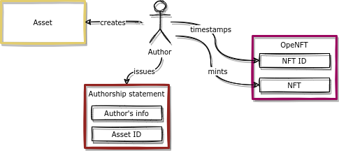
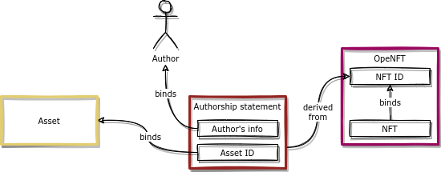
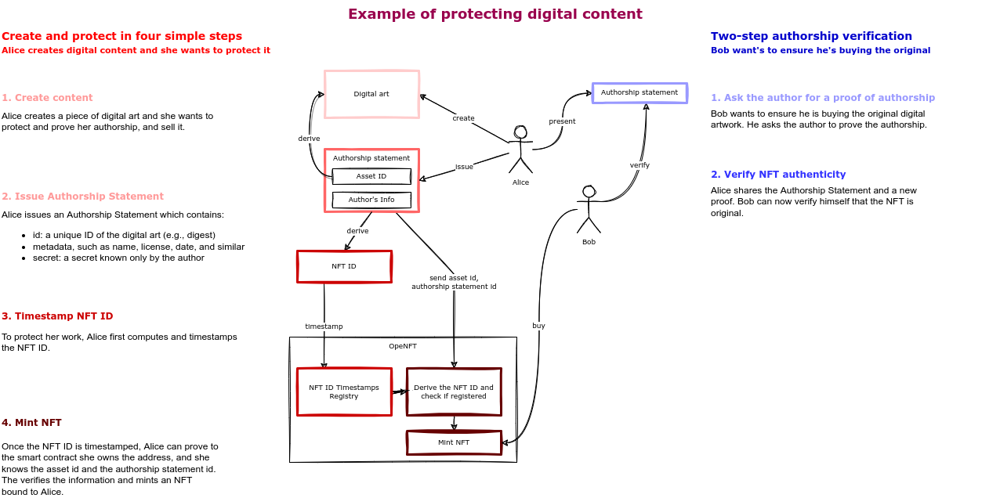

# OpeNFT - Open, decentralised, and authorship-preserving NFT binding

- Authors: Alen Horvat (Netis), Wesley Deglise (INNO)
- Status: Draft v2
- Created: 2022-09-03

A smart contract example is available [here](contracts/opeNFT-v2.sol).

You can experience NFT-binding in the [OpeNFT World](https://openft.world).

----

Table of Contents

- [OpeNFT - Open, decentralised, and authorship-preserving NFT binding](#openft---open-decentralised-and-authorship-preserving-nft-binding)
  - [Context switching variables](#context-switching-variables)
  - [Glossary](#glossary)
  - [OpeNFT](#openft)
    - [Abstract](#abstract)
    - [Introduction](#introduction)
    - [How does it work?](#how-does-it-work)
    - [Asset ID](#asset-id)
    - [NFT ID](#nft-id)
    - [Authorship statement](#authorship-statement)
    - [Timestamping the NFT ID](#timestamping-the-nft-id)
    - [Minting an NFT](#minting-an-nft)
    - [Security and privacy considerations](#security-and-privacy-considerations)
  - [Roadmap](#roadmap)
  - [Copyright](#copyright)
  - [References](#references)
  - [Credits](#credits)

## Context switching variables

The table below defines some variable and assign different values based on the context allowing to maintain only one document.

| Variable name        | EVM                  | Tezos |
| -------------------- | -------------------- | ----- |
| \{\{NFT_standard\}\} | ERC-721 and ERC-1155 | FA2   |
| \{\{Protocol\}\}     | Ethereum             | Tezos |

## Glossary

- An **artifact** is a digital or physical object or a thing
- An **authorship statement** recognises individual author contributions, reduces authorship disputes, facilitates collaboration, and enables authors to prove their authorship. The statement can be issued in a digital or physical form. We introduce digital author statements as presented in this documentation.
- **Non-Fungible Token (NFT)** is a unique digital identifier that cannot be copied, substituted, or subdivided, that is recorded in a blockchain, and that is used to certify authenticity and ownership (as of a specific digital asset and specific rights relating to it)
- **NFT-binding** is a process that associates an author statement and the artifact with an NFT

## OpeNFT

### Abstract

Binding physical or digital assets to NFTs on a public blockchain is challenging, as all the blockchain transactions are public, and information is easy to copy, giving malicious actors an excellent opportunity to steal your work or sell fake products. Hence, a secure and reliable NFT-binding process is crucial to protect authors, buyers, and sellers. We introduce an open NFT binding process that enables everyone to bind digital or physical assets to NFTs reliably and securely.

### Introduction

{{NFT_standard}} standardise how to transfer NFT and other token ownership. {{NFT_standard}} standard extensions define on-chain and off-chain NFT metadata that is used to reference a digital asset. The most common NFT minting process today is the following:

- Create content
- Create a collection (individually or via a platform)
- Mint an NFT within the collection
- Publish your content
- Reference your content in the NFT metadata (on-chain or off-chain)

Many NFT platforms offer simple UI where most actions are performed behind the scene.

The process faces several challenges. First, NFTs and assets are bound via a URL, and content at that URL is, in most cases, mutable. Second, the current NFT minting model does not allow you to prove you created the artifact. As an attacker, I can see your transaction and mint another NFT that references your work; note that the attacker can copy your content. Third, the current model does not protect the buyers, as they don't have an assurance the digital work referenced with the NFT was minted by the author (or with the author's authorisation). Fourth, the current model does not for a secure binding of physical artifacts like contracts or physical items with NFTs.

To overcome the issues, we are introducing a simple approach that enables us to protect creators, buyers, and sellers. The process allows authors to prove their authorship at any time and to mint the NFT bound to their work without risks of front running or other attacks. The authors to prove and buyers/sellers to verify the work's authorship.

### How does it work?

In the proposed model, the author creates an artifact, issues an authorship statement, timestamps the authorship statement, and mints the NFT by proving control over an address and knowledge of the authorship statement. The diagram below summarises the actions.

In the diagram below, we present how an authorship statement and the OpeNFT smart contract bind the asset, the holder, and the NFT

The diagram below summarises the minting and verification flows.

### Asset ID

First, we need to uniquely identify digital or physical objects we are binding to an NFT. The exact process of identifying artifacts, proving the authenticity, etc., is in the scope of the use case or a domain and is outside this work's scope. Once an artifact or an asset is identified, we compute the asset id as:

We define asset ID as SHA-256 hash of the asset identifier: `asset_id = sha256(asset identifier)`

### NFT ID

NFT identifier uniquely identifies an NFT and is computed as:

- `nft_id = sha256(author's {{Protocol}} address || asset_id)`
- `nft_id = sha256(author's {{Protocol}} address || asset_id || authorship_statement_id)`

To give authors the ability to prove authorship, we introduce an authorship statement as presented in the next section. Authorship statement id is defined as: `authorship_statement_id = sha256(authorship statement)`

### Authorship statement

Authorship statements aim to protect the author and the buyer. The authorship statement binds a digital or physical artifact, NFT, and the author, and enables including the information required for author or artifact identification. The authorship statement can be self-issued or issued by a guarantor. The authorship statement enables the buyers to verify the authorship of the NFT and the digital/physical artifact.

The minimal Authorship Statement must include the asset identifier and a secret. The secret aims to enable authors to prove their authorship using simple or advanced cryptographic methods. The secret can be a hash of a random number (like a password), a public key, or a zero-knowledge proof. Other ways of binding an identity to the NFT are including personal information or referencing legal contracts (physical or digital) or other documents. The statement may include additional metadata, such as the date of creation or issuance, rights, guarantor's statement, licensing information, and others. Use cases or domains must define what metadata the Authorship Statement should include. Authorship statements can also be e-signed or e-sealed, according to the regulation.

The authorship statement data model is defined in the specifications.

### Timestamping the NFT ID

Timestamping the NFT id is an important step for protecting the NFT minting process. Everyone can timestamp an NFT ID, but only the author, who owns the address and knows the asset id and authorship statement id can mint it.

### Minting an NFT

Once we timestamped the NFT ID, we can mint the NFT only if our transaction

- is sent from the address from which the NFT is derived
- contains the correct asset_id
- contains the correct authorship claim id

The smart contract will derive the NFT ID `nft_id_derived = sha256(sender's {{Protocol}} address || asset_id || authorship_statement_id)` and check whether the NFT ID is registered and it will mint an NFT.

### Security and privacy considerations

- If you publish your work before you register the author's statement, a malicious actor may steal your work
- If you try to mint the NFT before you timestamp the NFT ID, a malicious actor may steal your work
- You can reveal the secret only after you register the author's statement
- We recommend using public keys or ZKPs for proving authorship

## Roadmap

- TZIP proposal
- ERC proposal
- OpeNFT (website, SC) - openft.world
- Integration with [SSI Snap](https://blockchain-lab-um.github.io/ssi-snap-docs/docs/tutorial/implementation)

## Copyright

Copyright and related rights waived via
[CC0](https://creativecommons.org/publicdomain/zero/1.0/).

## References

- [Detailed specification](docs/specification.md)
- [TZIP Proposal](docs/TZIP-proposal.md)
- [TZIP PR](https://gitlab.com/tezos/tzip/-/merge_requests/196)
- [ERC Proposal](docs/ERC-proposal.md)
- [Test ERC SC](https://goerli.etherscan.io/address/0xc46399da201b4e6dd717f310444263de6a42e4ef)

## Credits

- [Netis](https://netis.si/en/)
- [INNO](https://www.linkedin.com/company/inno-nation)